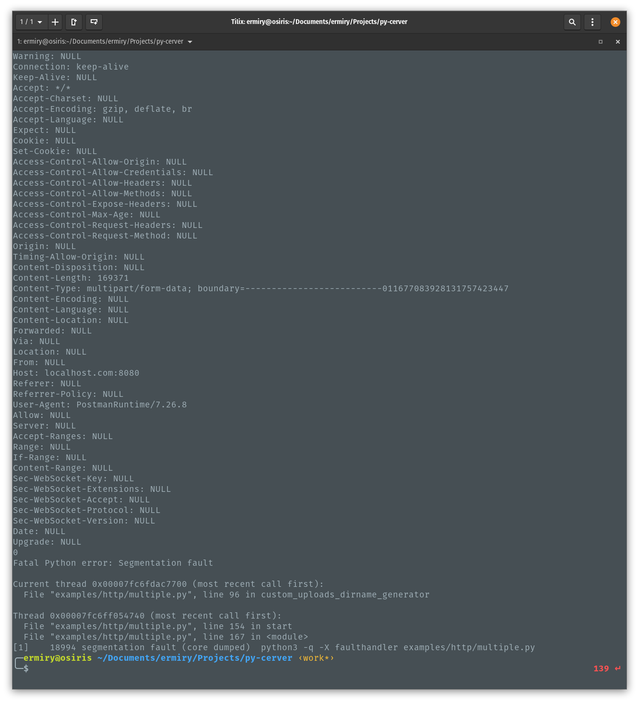
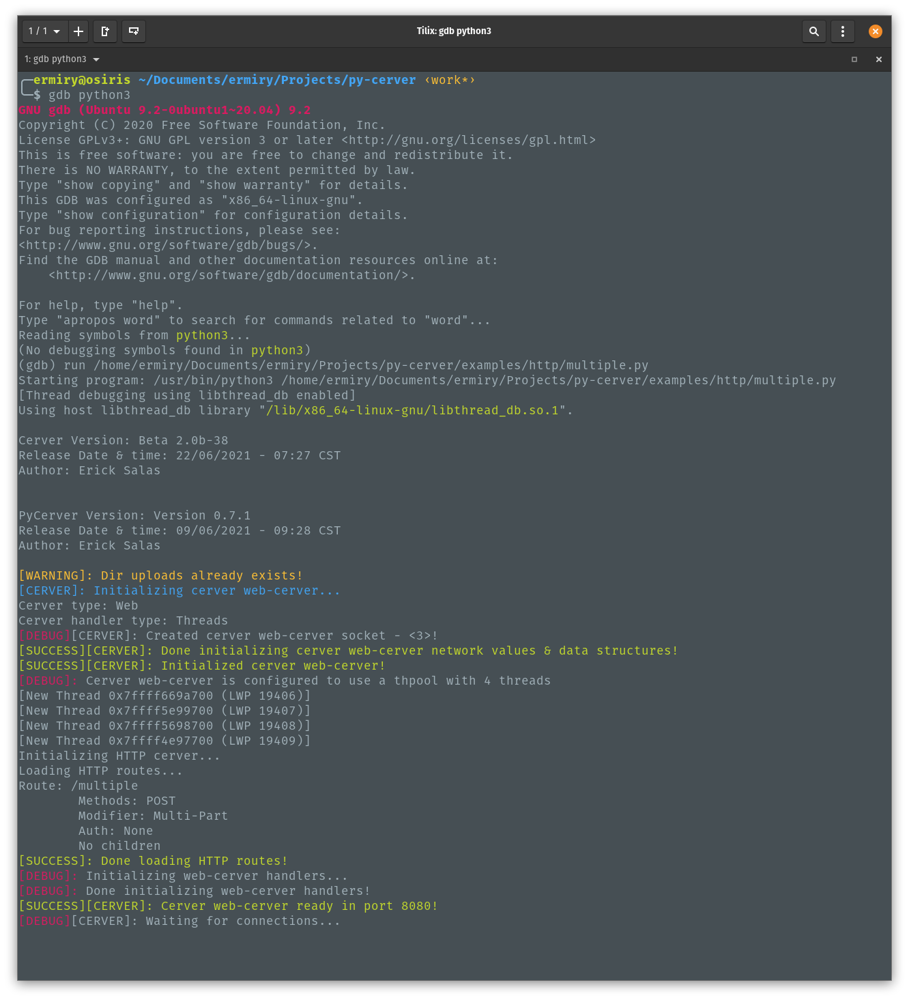
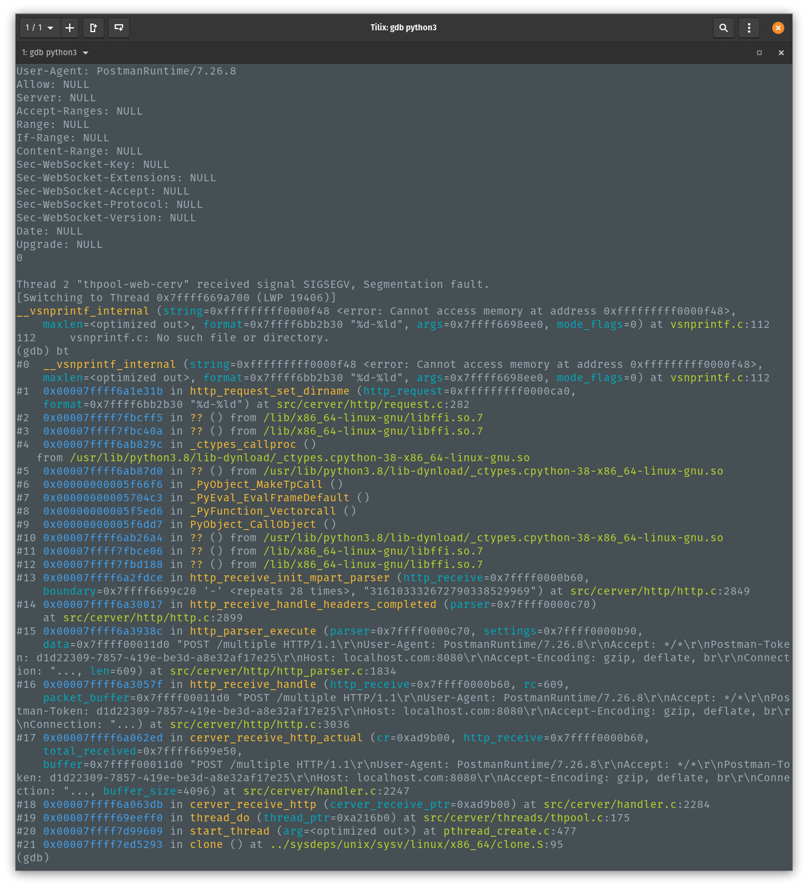

# Debug PyCerver

## faulthandler

1. Run example using faulthandler

```
python3 -q -X faulthandler examples/http/multiple.py
```

2. Example segfault output



## gdb

1. Run python3 using gdb

```
gdb python3
```

2. Run example inside gdb 

```
run /home/ermiry/Documents/ermiry/Projects/py-cerver/examples/http/multiple.py
```



3. Example segfault output


